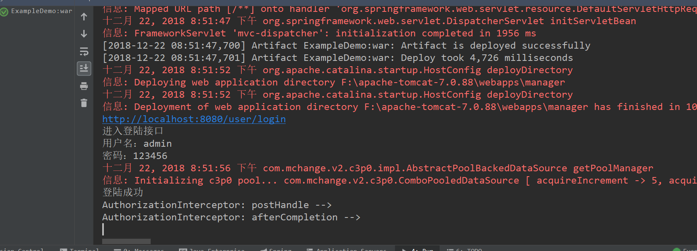
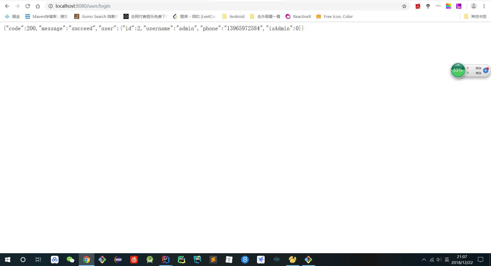
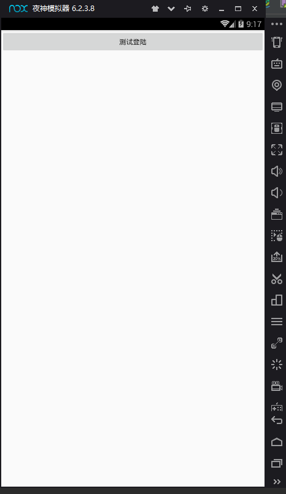
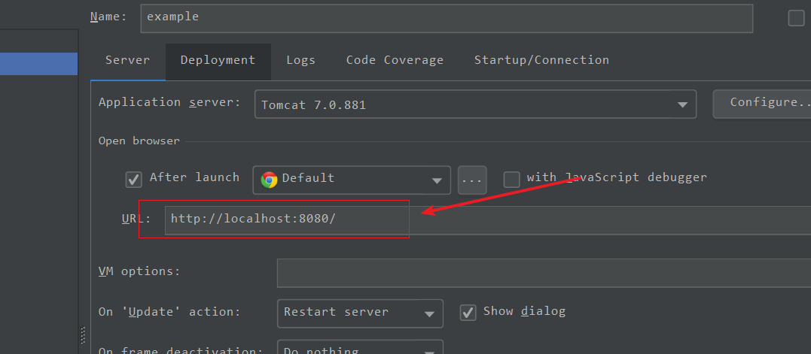

# RearDemo

搭建过程出现问题请看文档最后，
搭建过程出现问题请看文档最后，
搭建过程出现问题请看文档最后，
重要的事情说三遍！！！

简书中毕设有关打通前后台的代码示例，这里是后台的代码

转眼大四，毕设已经开始，毕业也不再遥远，作为大学的最后一个作业，我想要完成的好一些。再加上之前一直想要学习后台的写法
不能只知道看前端部分。也是为了给更多的人帮助。毕竟自己为了能够会打通前后端废了不少力气
希望大家可以少走一些弯路。这里虽然只是示例，但是开头难，相信美好的明天在等着大家

tips: android 端涉及到的代码我已经放在 androidFile 文件夹下了，不过依赖需要大家自己添加。主要是 RxJava 和 Retrofit 的依赖。布局文件和其他都有

运行结果如下

issue：当你导入项目发现点击测试接口出现 404 错误的时候，请你查看自己的 tomcat 服务器的配置是否是这样

如果你的 tomcat 中多了项目名称的话说明是 tomcat 的配置有所不同而已。此时你把测试接口的 action 路径中最前面的 / 去掉就可以了。
他这个代表的是根路径，从 8080 端口号之后开始
